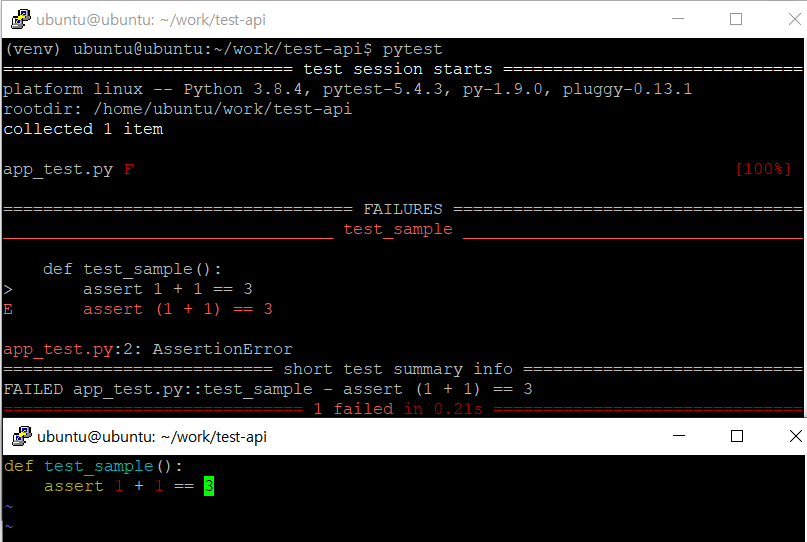
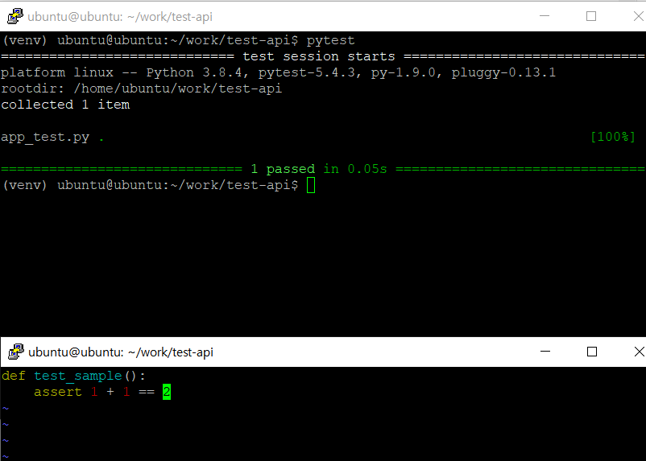

# pytest 설치 및 실습  
> python 코드 테스트를 위한 pytest   
> pyenv 실습 후 진행된 글
  
  
### pytest 설치
~~~
pip install -U pytest
~~~

### requirements.txt 생성 & 기존에 설치된 라이브러리들 넣기
~~~
pip freeze > requirements.txt
~~~

#### requirements 쓰는법?  
 * 라이브러리만 써도되고, 라이브러리명==버젼까지 쓰는것이 좋다. (프로젝트 할시)  
requirements.txt (예시)  
~~~
pytest==5.4.3
pytest-watch
~~~
위와 같이 두 방법 가능.  
 
### requirements.txt 기반 라이브러리 설치
~~~
pip install -r requirements.txt
~~~
 
### 설치된 라이브러리 모두 제거 (아직안해봄)
~~~
pip freeze | xargs pip uninstall -y
~~~
 
### pytest 실행
~~~
pytest
~~~

### 간단한 실습
#### pytest 실행 후 정상과 아닌 것 비교 

#### app_test.py 생성 (코드오류)  
~~~
def test_sample():
    assert 1 + 1 == 3
~~~

#### app_test.py 생성 (정상)  
~~~
def test_sample():
    assert 1 + 1 == 2
~~~

